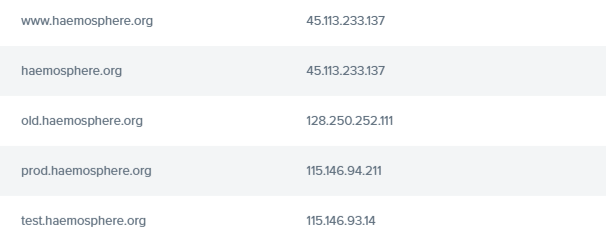

### Haemosphere Version 5 Documenation

Link to access the NECTAR Dashboard: [URL](https://dashboard.rc.nectar.org.au/project/instances/) and select unimelb-haemosphere project from the drop down list box in the toolbar.

As at 17/2/22 the Live Server is still running the py2 version of haemosphere and can be accessed at https://haemosphere.org

We previously launched Version 5 of Haemosphere on IP: `45.113.233.137`, but this was rolled back as it crashed during DE searches as they timed out. We are currently exploring a fix for this.

The Live Server has an attached and mounted volume in which Haemosphere application is loaded and started.

Mounted volume- `/pvol` and the application can be accessed at `/pvol/haemosphere`

- The Pre Production server is running another instance of Version 5 Haemosphere on IP `115.146.94.211` and can be accessed at https://prod.haemosphere.org/
- The Test server is running another instance of Version 5 Haemosphere with changes on its UI (VueJs + Bootstrap) on IP `115.146.93.14`  and can be accessed at http://test.haemosphere.org/
- The Version 4 of the Haemosphere is running on WEHI's Interal servers at IP: `128.250.252.111` and can be accessed at https://old.haemosphere.org/

To login to any of the instance, after the public keys of your computer has been added to the instance, 

`ssh -i keys ec2-user@45.113.233.137` from your terminal. Use the different IP address to access different servers.

New public keys for additional users/computers can be added to a server in .ssh/authorized_keys once you are logged in

Note that the ec2-user is the user-id of the instance and attach your private keys on your ssh request

The old.haemosphere.org is pointed to INTERNAL WEHI Server, reach out to Carolyn and request support.

